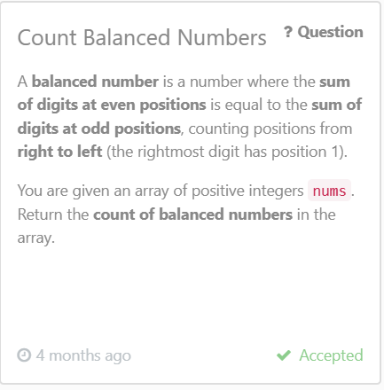

This questions if for  difficulty is Easy ( it mainly requires loops, modulo operations, and basic logic, making it suitable for people learning number-based problems.)

this questions is got accepted by leetcode 